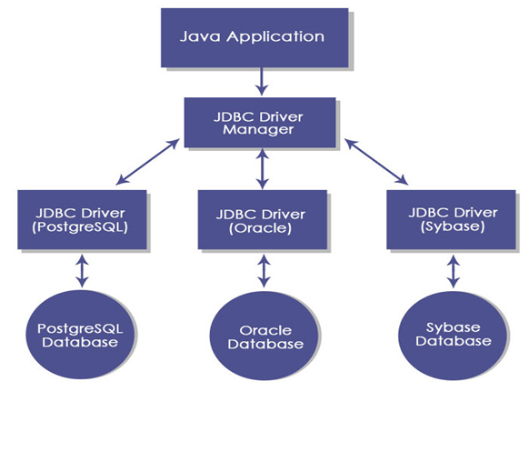

# JavaProject

Synopsis - Mini Project

Green Bank - Online Banking System

Introduction
 
Created by: Sanskriti Shukla
 Class: - CSE(G) IVth Semester 
RollNo.18100BTCSICS03038      

Objective 

The main purpose of Online Banking Solution is to provide customers with an ability to make transactions online over a very user friendly interface.

Facilities provided

•	View Account: Customer is authorized to check his account.

•	Transfer Money: Customer can transfer money online over a secure passage to another account.

•	Application Forms: Different forms such as new cheque book request, change of address etc can be downloaded.

•	Customer Help: A document enabling customers to understand Online Banking.

•	Transfer Money: Customer can transfer money online over a secure passage to another account.

•	Withdraw Money: Customer can withdraw money online over a secure passage from there account.

• Loan Request : Customer can make loan reqeusts online over a secure passage to bank.

•	Deposit Schemes : Customer can deposit money online over a secure passage for there account.

Architecture of Online Banking (Green Bank)

The 3-tiered architecture shown above has the following major components:

•	Client: There will be two clients for the application. One will be a web-based user-friendly client called bank customers. The other will be for administration purposes.

•	Application Server: It takes care of the server script, takes care of JDBC-ODBC driver, and checks for the ODBC connectivity for mapping to the database in order to fulfill client and administrator’s request.

•	Database: Database Servers will stores customer’s and bank da

SCREENSHOTS
HOME PAGE
.png)

ABOUT PAGE
.png)

CREATE ACCOUNT PAGE
.png)
  

LOGIN PAGE
.png)

DEPOSIT SCHEMES PAGE
.png)
 
SILVER SCHEME PAGE
.png) 

BRONZE SCHEME PAGE
.png)  

LOAN REQUEST PAGE
.png)  

CONFORMATION PAGE
.png)
 
TRANSFER PAGE
.png)
 
WITHDRAW PAGE
.png)

